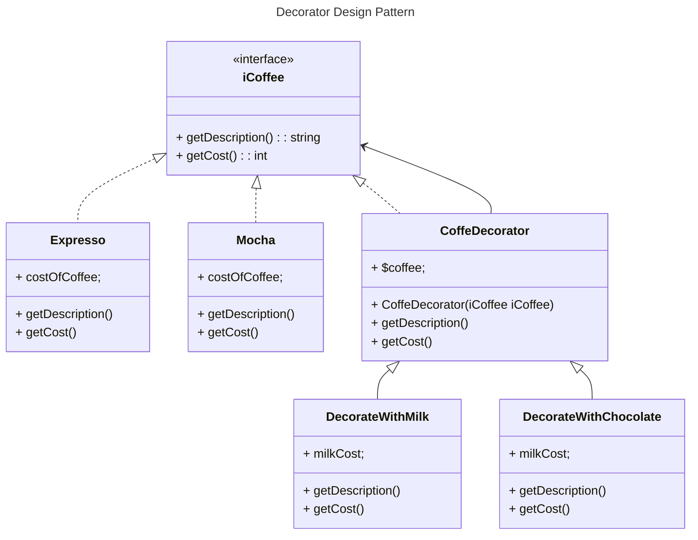

```mermaid

---
title: Decorator Design Pattern
---

classDiagram

iCoffee <|.. Expresso
iCoffee <|.. Mocha
iCoffee <|.. CoffeDecorator
iCoffee <-- CoffeDecorator

CoffeDecorator <|-- DecorateWithMilk
CoffeDecorator <|-- DecorateWithChocolate


class iCoffee {
    <<interface>>
    + getDescription(): string
    + getCost(): int
}

class Expresso {
    + costOfCoffee;
    + getDescription()
    + getCost()
}

class Mocha {
    + costOfCoffee;
    + getDescription()
    + getCost()
}


class CoffeDecorator {
    + $coffee;
    + CoffeDecorator(iCoffee iCoffee)
    + getDescription()
    + getCost()
}

class DecorateWithMilk{
    + milkCost;
    + getDescription()
    + getCost()
}

class DecorateWithChocolate {
    + milkCost;
    + getDescription()
    + getCost()

}


```