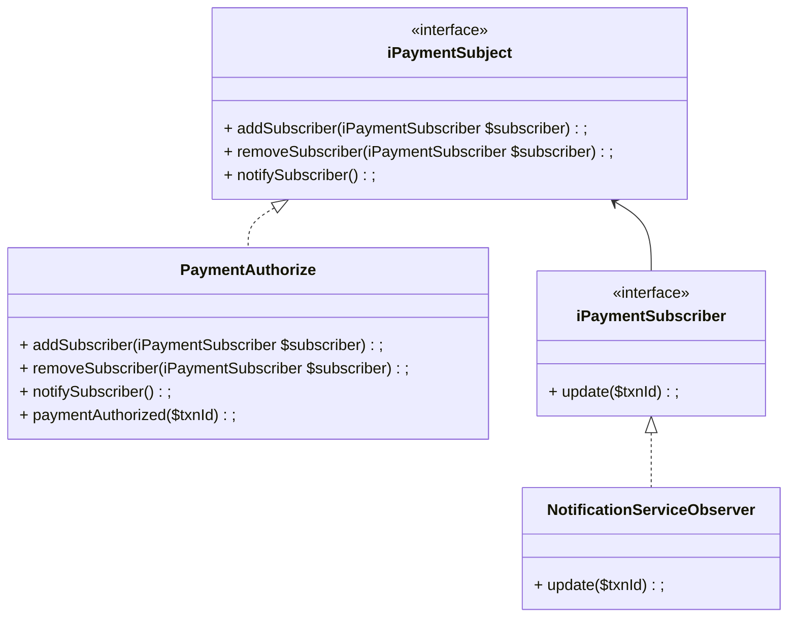

```mermaid


classDiagram
iPaymentSubject <|.. PaymentAuthorize
iPaymentSubscriber <|.. NotificationServiceObserver
iPaymentSubject <-- iPaymentSubscriber


class iPaymentSubject {
    <<interface>>
    + addSubscriber(iPaymentSubscriber $subscriber);
    + removeSubscriber(iPaymentSubscriber $subscriber); 
    + notifySubscriber(); 
}

class iPaymentSubscriber {
    <<interface>>
    + update($txnId);
}

class PaymentAuthorize {
    + addSubscriber(iPaymentSubscriber $subscriber);
    + removeSubscriber(iPaymentSubscriber $subscriber); 
    + notifySubscriber(); 
    + paymentAuthorized($txnId);
}


class NotificationServiceObserver {
    + update($txnId);
}


```