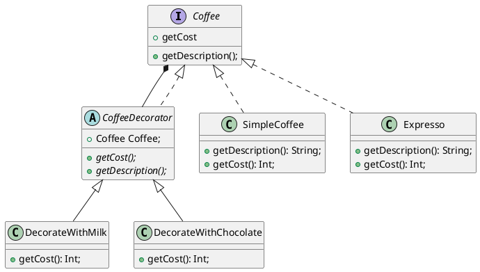

```plantuml

@startuml Decorator Design Pattern

Coffee *-- CoffeeDecorator

interface Coffee {
    + getDescription();
    + getCost
}

Class SimpleCoffee implements Coffee {
    + getDescription(): String;
    + getCost(): Int;
}

Class Expresso implements Coffee {
    + getDescription(): String;
    + getCost(): Int;
}

abstract class CoffeeDecorator implements Coffee {
    + Coffee Coffee;
    + {abstract} getCost();
    + {abstract} getDescription();
}

Class DecorateWithMilk extends CoffeeDecorator {
    + getCost(): Int;

}

Class DecorateWithChocolate extends CoffeeDecorator {
    + getCost(): Int;

}

@enduml

```